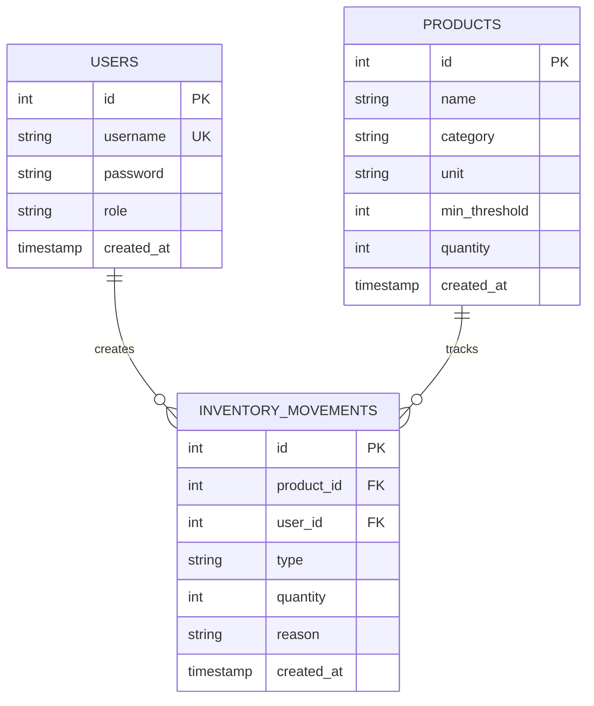

# 📊 ERD – Tables & Relations

## Diagramme Entité-Relation (ER Diagram)



---

## 📋 Détail des Tables

### **TABLE: USERS**

**Description** : Gère l'authentification et les autorisations.

| Colonne | Type | Contrainte | Description |
|---------|------|-----------|---|
| `id` | `SERIAL` | PRIMARY KEY, AUTO_INCREMENT | Identifiant unique |
| `username` | `VARCHAR(50)` | UNIQUE, NOT NULL | Nom d'utilisateur unique |
| `password` | `VARCHAR(255)` | NOT NULL | Mot de passe hashé (bcrypt) |
| `role` | `VARCHAR(20)` | NOT NULL, DEFAULT 'EMPLOYE' | Rôle : RESPONSABLE ou EMPLOYE |
| `created_at` | `TIMESTAMP` | DEFAULT NOW() | Date de création |

**Indices** :
```sql
CREATE INDEX idx_users_username ON users(username);
```

**Énumé** :
```sql
CREATE TYPE user_role AS ENUM ('RESPONSABLE', 'EMPLOYE');
```

**Exemple d'insertion** :
```sql
INSERT INTO users (username, password, role) 
VALUES ('alice', '$2b$10$...hashed_pwd...', 'RESPONSABLE');
```

---

### **TABLE: PRODUCTS**

**Description** : Catalogue des produits disponibles au stock.

| Colonne | Type | Contrainte | Description |
|---------|------|-----------|---|
| `id` | `SERIAL` | PRIMARY KEY, AUTO_INCREMENT | Identifiant unique |
| `name` | `VARCHAR(160)` | NOT NULL | Nom du produit |
| `category` | `VARCHAR(120)` | NOT NULL | Catégorie (Burger, Boisson, Ingrédient, etc.) |
| `unit` | `VARCHAR(40)` | - | Unité de mesure (L, kg, pièce, etc.) |
| `min_threshold` | `INTEGER` | DEFAULT 0, CHECK ≥ 0 | Seuil minimal pour alerte |
| `quantity` | `INTEGER` | DEFAULT 0 | Quantité actuelle (dénormalisée pour rapidité) |
| `created_at` | `TIMESTAMP` | DEFAULT NOW() | Date de création |

**Indices** :
```sql
CREATE INDEX idx_products_name ON products(name);
CREATE INDEX idx_products_category ON products(category);
```

**Contraintes** :
```sql
ALTER TABLE products ADD CONSTRAINT check_min_threshold 
  CHECK (min_threshold >= 0);
```

**Exemple d'insertion** :
```sql
INSERT INTO products (name, category, unit, min_threshold) 
VALUES ('Farine blanche', 'Ingrédients', 'kg', 10);
```

---

### **TABLE: INVENTORY_MOVEMENTS**

**Description** : Historique complet et détaillé de tous les mouvements de stock.

| Colonne | Type | Contrainte | Description |
|---------|------|-----------|---|
| `id` | `SERIAL` | PRIMARY KEY, AUTO_INCREMENT | Identifiant unique |
| `product_id` | `INTEGER` | NOT NULL, FK → products.id | Référence au produit |
| `user_id` | `INTEGER` | NOT NULL, FK → users.id | Utilisateur responsable du mouvement |
| `type` | `movement_type ENUM` | NOT NULL | Type : ENTREE, SORTIE, PERTE |
| `quantity` | `INTEGER` | NOT NULL, CHECK > 0 | Quantité du mouvement (toujours positive) |
| `reason` | `VARCHAR(255)` | - | Motif du mouvement |
| `created_at` | `TIMESTAMP` | DEFAULT NOW() | Timestamp précis |

**Indices** :
```sql
CREATE INDEX idx_movements_product ON inventory_movements(product_id);
CREATE INDEX idx_movements_user ON inventory_movements(user_id);
CREATE INDEX idx_movements_created ON inventory_movements(created_at);
CREATE INDEX idx_movements_type ON inventory_movements(type);
```

**Énumé** :
```sql
CREATE TYPE movement_type AS ENUM ('ENTREE', 'SORTIE', 'PERTE');
```

**Clés Étrangères** :
```sql
ALTER TABLE inventory_movements 
  ADD CONSTRAINT fk_movements_product 
    FOREIGN KEY (product_id) REFERENCES products(id) 
    ON DELETE RESTRICT;

ALTER TABLE inventory_movements 
  ADD CONSTRAINT fk_movements_user 
    FOREIGN KEY (user_id) REFERENCES users(id) 
    ON DELETE RESTRICT;
```

**Contrainte de domaine** :
```sql
ALTER TABLE inventory_movements 
  ADD CONSTRAINT check_quantity_positive 
    CHECK (quantity > 0);
```

**Exemple d'insertion** :
```sql
INSERT INTO inventory_movements (product_id, user_id, type, quantity, reason) 
VALUES (1, 2, 'SORTIE', 5, 'Vente du jour');
```

---

## 🔗 Relations

### Relation 1 : USERS → INVENTORY_MOVEMENTS
- **Cardinalité** : 1 USERS : N INVENTORY_MOVEMENTS
- **Contraint par** : Clé étrangère `user_id`
- **Action de suppression** : RESTRICT (empêche de supprimer un utilisateur ayant des mouvements)
- **Sens métier** : Un utilisateur peut créer plusieurs mouvements de stock

### Relation 2 : PRODUCTS → INVENTORY_MOVEMENTS
- **Cardinalité** : 1 PRODUCTS : N INVENTORY_MOVEMENTS
- **Contraint par** : Clé étrangère `product_id`
- **Action de suppression** : RESTRICT (empêche de supprimer un produit ayant un historique)
- **Sens métier** : Un produit a un historique de mouvements de stock

---

## 🔍 Vues (Views)

### Vue 1 : `v_product_stock`

**Objectif** : Afficher le stock actuel pour chaque produit.

```sql
CREATE VIEW v_product_stock AS
SELECT
  p.id AS product_id,
  p.name AS product_name,
  p.category,
  p.unit,
  p.min_threshold,
  COALESCE(SUM(
    CASE
      WHEN m.type = 'ENTREE' THEN m.quantity
      WHEN m.type IN ('SORTIE', 'PERTE') THEN -m.quantity
    END
  ), 0) AS stock_actuel
FROM products p
LEFT JOIN inventory_movements m ON m.product_id = p.id
GROUP BY p.id, p.name, p.category, p.unit, p.min_threshold;
```

**Sortie résultante** :
```
product_id | product_name      | category      | unit | min_threshold | stock_actuel
-----------|-------------------|---------------|------|---------------|-------------
1          | Farine blanche    | Ingrédients   | kg   | 10            | 75
2          | Huile tournesol   | Ingrédients   | L    | 5             | 18
3          | Pain complet      | Produits      | pce  | 3             | 8
```

---

### Vue 2 : `v_alerts_critical_products`

**Objectif** : Identifier les produits en seuil critique.

```sql
CREATE VIEW v_alerts_critical_products AS
SELECT
  product_id,
  product_name,
  min_threshold,
  stock_actuel,
  (min_threshold - stock_actuel) AS quantity_needed
FROM v_product_stock
WHERE stock_actuel <= min_threshold
ORDER BY stock_actuel ASC;
```

**Sortie résultante** :
```
product_id | product_name     | min_threshold | stock_actuel | quantity_needed
-----------|------------------|---------------|--------------|----------------
5          | Sauce tomate     | 15            | 8            | 7
7          | Fromage râpé     | 5             | 3            | 2
```

---

### Vue 3 : `v_last_movements`

**Objectif** : Afficher les 10 derniers mouvements avec contexte.

```sql
CREATE VIEW v_last_movements AS
SELECT
  m.id AS movement_id,
  p.name AS product_name,
  u.username AS user_name,
  m.type,
  m.quantity,
  m.reason,
  m.created_at,
  ROW_NUMBER() OVER (ORDER BY m.created_at DESC) AS rank
FROM inventory_movements m
JOIN products p ON m.product_id = p.id
JOIN users u ON m.user_id = u.id
ORDER BY m.created_at DESC
LIMIT 10;
```

---

### Vue 4 : `v_dashboard_kpis`

**Objectif** : Fournir des indicateurs clés (KPI) pour le tableau de bord.

```sql
CREATE VIEW v_dashboard_kpis AS
SELECT
  COUNT(DISTINCT p.id) AS total_produits,
  COUNT(DISTINCT 
    CASE WHEN ps.stock_actuel <= p.min_threshold THEN p.id END
  ) AS produits_en_alerte,
  SUM(ps.stock_actuel) AS stock_total,
  AVG(ps.stock_actuel) AS stock_moyen,
  COUNT(m.id) AS total_mouvements
FROM products p
LEFT JOIN v_product_stock ps ON p.id = ps.product_id
LEFT JOIN inventory_movements m ON p.id = m.product_id;
```

---

### Vue 5 : `v_dashboard_json`

**Objectif** : Exporter les KPI en format JSON pour Frontend.

```sql
CREATE VIEW v_dashboard_json AS
SELECT
  jsonb_build_object(
    'total_produits', COUNT(DISTINCT p.id),
    'produits_en_alerte', COUNT(DISTINCT 
      CASE WHEN ps.stock_actuel <= p.min_threshold THEN p.id END
    ),
    'stock_total', COALESCE(SUM(ps.stock_actuel), 0),
    'stock_moyen', COALESCE(AVG(ps.stock_actuel), 0),
    'derniera_mise_a_jour', NOW()
  ) AS dashboard_data
FROM products p
LEFT JOIN v_product_stock ps ON p.id = ps.product_id;
```

---

## 📊 Statistiques de la Schéma

| Élément | Quantité |
|---------|----------|
| **Tables** | 3 |
| **Vues** | 5 |
| **Énumérés** | 2 |
| **Indices** | 8 |
| **Clés Étrangères** | 2 |
| **Contraintes CHECK** | 2 |

---

## 🎯 Points d'Intégrité

### Intégrité Référentielle
- ✅ On ne peut PAS supprimer un produit s'il a des mouvements (FK RESTRICT)
- ✅ On ne peut PAS supprimer un utilisateur s'il a créé des mouvements (FK RESTRICT)
- ✅ Tout mouvement référence un produit existant
- ✅ Tout mouvement référence un utilisateur existant

### Intégrité de Domaine
- ✅ `min_threshold >= 0` (pas de seuils négatifs)
- ✅ `quantity > 0` dans les mouvements (les signes sont dans `type`)
- ✅ `type` limité à 3 valeurs : ENTREE, SORTIE, PERTE
- ✅ `role` limité à 2 valeurs : RESPONSABLE, EMPLOYE

### Intégrité Sémantique
- ✅ Stock calculé dynamiquement via `v_product_stock` (jamais dénormalisé)
- ✅ Alertes automatiques via vue `v_alerts_critical_products`
- ✅ Historique immuable (pas de DELETE, uniquement INSERT)

---

## 📈 Performances

### Indices Stratégiques

1. **idx_users_username** : Accélère authentification (UNIQUE INDEX)
2. **idx_products_name, idx_products_category** : Recherche de produits
3. **idx_movements_product** : Calcul de stock par produit
4. **idx_movements_user** : Traçabilité utilisateur
5. **idx_movements_created** : Requêtes chronologiques
6. **idx_movements_type** : Filtrage par type de mouvement

### Requêtes Critiques Optimisées

```sql
-- Temps attendu : < 10ms (avec indice)
SELECT * FROM v_product_stock WHERE product_id = 42;

-- Temps attendu : < 20ms (agrégation sur indice)
SELECT * FROM v_alerts_critical_products;

-- Temps attendu : < 50ms (historique avec JOIN via indices FK)
SELECT * FROM v_last_movements LIMIT 10;
```

---

**Document rédigé le : 11/03/2026**  
**Statut : COMPLET ✅**
