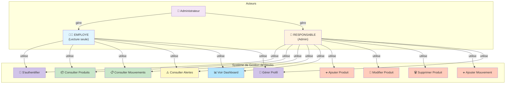
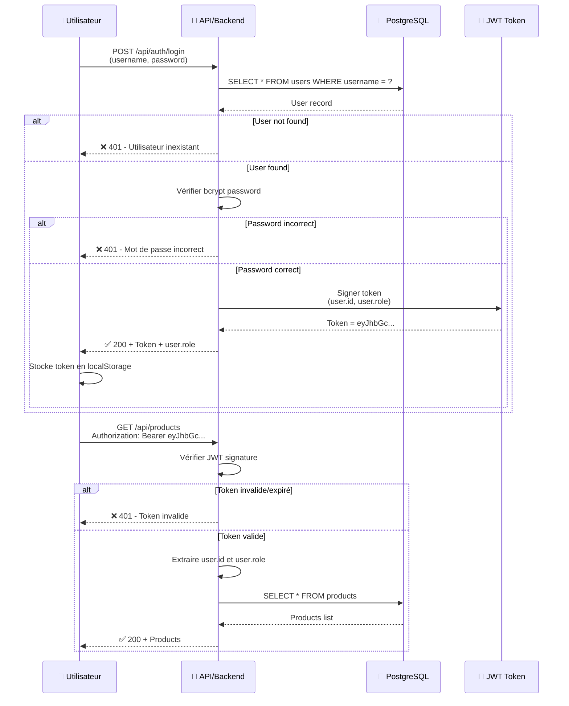

# 👥 Diagramme de Cas d'Utilisation (Use Case Diagram)

## Vue d'Ensemble



---

## 📋 Détail des Cas d'Utilisation

### **Acteur 1 : EMPLOYE** 🧑‍💼

**Rôle** : Utilisateur standard avec accès en lecture.

**Permissions** :
- ✅ Consulter produits
- ✅ Consulter mouvements
- ✅ Consulter alertes
- ✅ Voir dashboard
- ✅ S'authentifier
- ✅ Gérer profil
- ❌ Créer/Modifier/Supprimer produits
- ❌ Créer mouvements de stock

**Use Cases** :

#### UC1 : Consulter Produits
```
Titre : Consulter le Catalogue de Produits
Acteur Primaire : EMPLOYE
Précondition : EMPLOYE authentifié
Flux Principal :
  1. EMPLOYE clique sur "Produits"
  2. Système récupère liste produits depuis DB
  3. Affiche : Nom, Catégorie, Unité, Seuil min, Stock actuel
Flux Alternatif :
  - Si aucun produit : Afficher message "Catalogue vide"
Postcondition : Liste produits affichée
```

#### UC6 : Consulter Mouvements
```
Titre : Voir l'Historique des Mouvements
Acteur Primaire : EMPLOYE
Précondition : EMPLOYE authentifié
Flux Principal :
  1. EMPLOYE clique sur "Historique"
  2. Système affiche derniers 20 mouvements
  3. Mouvements triés par date (DESC)
  4. Affiche : Date, Produit, Type, Quantité, Responsable
Flux Alternatif :
  - Filtrer par produit si demandé
  - Pagination (20 par 20)
Postcondition : Historique affiché
```

#### UC7 : Consulter Alertes
```
Titre : Consulter Produits en Alerte
Acteur Primaire : EMPLOYE
Précondition : EMPLOYE authentifié
Flux Principal :
  1. EMPLOYE clique sur "⚠️ Alertes"
  2. Système interroge v_alerts_critical_products
  3. Affiche produits où stock_actuel ≤ min_threshold
  4. Tri par stock croissant (plus critique en haut)
Postcondition : Liste alertes affichée
```

#### UC8 : Voir Dashboard
```
Titre : Consulter le Tableau de Bord (KPI)
Acteur Primaire : EMPLOYE
Précondition : EMPLOYE authentifié
Flux Principal :
  1. EMPLOYE accède au Dashboard
  2. Système récupère v_dashboard_json
  3. Affiche :
     - Total produits
     - Nombre en alerte
     - Stock total
     - Stock moyen
     - Dernière mise à jour
Postcondition : Dashboard affiché
```

---

### **Acteur 2 : RESPONSABLE** 👔

**Rôle** : Administrateur avec accès complet.

**Permissions** :
- ✅ Toutes les permissions de EMPLOYE
- ✅ Créer/Modifier/Supprimer produits
- ✅ Créer mouvements de stock
- ✅ Tous les rapports

**Use Cases Additionnels** :

#### UC2 : Ajouter Produit
```
Titre : Créer un Nouveau Produit
Acteur Primaire : RESPONSABLE
Précondition : RESPONSABLE authentifié
Flux Principal :
  1. RESPONSABLE clique sur "+ Ajouter Produit"
  2. Formulaire : Nom, Catégorie, Unité, Seuil min
  3. RESPONSABLE remplit et valide
  4. Système insère dans table products
  5. Notification de succès
Flux Alternatif :
  - Produit existe déjà → Erreur "Produit dupliqué"
  - Seuil négatif → Erreur "Seuil > 0"
Postcondition : Produit créé avec stock initial = 0
Règle Métier : min_threshold >= 0
```

#### UC3 : Modifier Produit
```
Titre : Mettre à Jour un Produit
Acteur Primaire : RESPONSABLE
Précondition : RESPONSABLE authentifié, Produit existe
Flux Principal :
  1. RESPONSABLE cherche produit
  2. Clique sur "✏️ Éditer"
  3. Formulaire pré-rempli
  4. Modifie (nom, catégorie, seuil)
  5. Système UPDATE produit
  6. Notification de succès
Postcondition : Produit mis à jour
Règles Métier :
  - Ne pas modifier le stock directement (via mouvements)
  - min_threshold >= 0
```

#### UC4 : Supprimer Produit
```
Titre : Supprimer un Produit
Acteur Primaire : RESPONSABLE
Précondition : RESPONSABLE authentifié, Produit existe
Flux Principal :
  1. RESPONSABLE sélectionne produit
  2. Clique sur "🗑️ Supprimer"
  3. Confirmation : "Êtes-vous sûr ?"
  4. Système tente DELETE
Flux Alternatif :
  - Si mouvements liés → Erreur "Impossible, historique présent"
  - Confirmation refusée → Opération annulée
Postcondition : Produit supprimé (ou erreur FK)
Sécurité : Impossible de supprimer si historique
```

#### UC5 : Ajouter Mouvement de Stock
```
Titre : Enregistrer un Mouvement de Stock
Acteur Primaire : RESPONSABLE
Précondition : RESPONSABLE authentifié, Produit existe
Flux Principal :
  1. RESPONSABLE clique sur "+ Mouvement"
  2. Sélectionne produit
  3. Choisit type : ENTREE / SORTIE / PERTE
  4. Saisit quantité (> 0)
  5. Ajoute reason (motif)
  6. Valide
  7. INSERT dans inventory_movements
  8. Système recalcule stock via v_product_stock
  9. Si stock <= seuil → Génère alerte
  10. Notifications envoyées
Flux Alternatif :
  - Quantité ≤ 0 → Erreur
  - Type invalide → Erreur
  - Produit inexistant → Erreur 404
Postcondition : Mouvement enregistré, stock recalculé
Règles Métier :
  - ENTREE : +quantité
  - SORTIE : -quantité
  - PERTE : -quantité
  - Quantité toujours positive (signe = type)
```

---

### **Acteur 3 : Administrateur Système** 🔑

**Rôle** : Gestion des utilisateurs et droits.

**Use Cases** :

#### UC11 : Créer Utilisateur
```
Titre : Créer un Nouvel Utilisateur
Acteur Primaire : Administrateur
Flux Principal :
  1. Admin crée nouvel utilisateur
  2. Spécifie : username, role (EMPLOYE/RESPONSABLE)
  3. Mot de passe temporaire
  4. Utilisateur reçoit email
  5. Doit changer mot de passe au premier login
```

#### UC12 : Réinitialiser Mot de Passe
```
Titre : Réinitialiser le Mot de Passe
Acteur Primaire : Admin ou Utilisateur
Flux Principal :
  1. Utilisateur clique "Mot de passe oublié"
  2. Saisit username/email
  3. Reçoit lien de réinitialisation
  4. Crée nouveau mot de passe
  5. Nouveau JWT généré
```

---

## 🔐 Flux d'Authentification



---

## 📊 Résumé des Permissions par Rôle

| Action | EMPLOYE | RESPONSABLE | Admin |
|--------|---------|-------------|-------|
| **Consulter Produits** | ✅ | ✅ | ✅ |
| **Créer Produit** | ❌ | ✅ | ✅ |
| **Modifier Produit** | ❌ | ✅ | ✅ |
| **Supprimer Produit** | ❌ | ✅ | ✅ |
| **Créer Mouvement** | ❌ | ✅ | ✅ |
| **Consulter Mouvements** | ✅ | ✅ | ✅ |
| **Consulter Alertes** | ✅ | ✅ | ✅ |
| **Voir Dashboard** | ✅ | ✅ | ✅ |
| **Gérer Utilisateurs** | ❌ | ❌ | ✅ |
| **Recevoir Alertes** | ✅ | ✅ | ✅ |

---

## 🎯 Scénarios Complets

### Scénario 1 : Journée Type – EMPLOYE

```
09:00 → EMPLOYE se connecte
10:00 → Consulte produits (check catalogue)
10:15 → Voit alertes (Pain critique)
10:30 → Consulte dashboard (KPI)
11:00 → Vérifie historique (20 derniers mouvements)
12:00 → Se déconnecte
```

### Scénario 2 : Gestion de Stock – RESPONSABLE

```
08:00 → RESPONSABLE se connecte
08:15 → Ajoute mouvement : Livraison 50kg Farine
08:30 → Stock recalculé automatiquement (avec alerte check)
09:00 → Ajoute mouvement : Vente 15 baguettes
09:15 → Vérifi dashboard (tout en vert)
10:00 → Ajoute nouveau produit "Croissants"
10:30 → Configure seuil alerte à 30
11:00 → Se déconnecte
```

### Scénario 3 : Réponse à Alerte – RESPONSABLE

```
14:00 → RESPONSABLE reçoit alerte "Sauce tomate = 5 (seuil 15)"
14:05 → Consulte historique produit (ventes récentes élevées)
14:10 → Contacte fournisseur
14:30 → Reçoit livraison 40L sauce
14:35 → Enregistre mouvement : ENTREE 40L, motif = "Livraison fournisseur"
14:40 → Stock recalculé = 45L (alerte levée)
14:50 → Dashboard mis à jour en temps réel
```

---

## ✅ Points de Validation

- [ ] Deux rôles clairs : EMPLOYE, RESPONSABLE
- [ ] RESPONSABLE = admin complet
- [ ] EMPLOYE = lecture seule (lecture produits, historique, alertes)
- [ ] Authentification JWT requise pour tous les use cases
- [ ] Chaque action traçable (user_id, created_at dans mouvements)
- [ ] Alertes générées automatiquement
- [ ] Stock recalculé en temps réel

---

**Document rédigé le : 11/03/2026**  
**Statut : COMPLET ✅**
