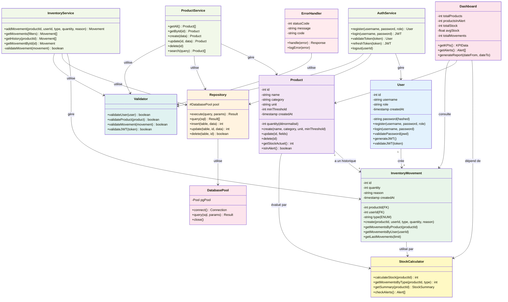

# 📐 Diagramme de Classes (Class Diagram)

## Vue d'Ensemble – Architecture Logique



---

## 📋 Détail des Classes

### **Classe : User** (Données d'authentification)

```java
class User {
    // Attributs
    - int id [PRIMARY KEY]
    - string username [UNIQUE]
    - string password [bcrypt hashé]
    - string role ["RESPONSABLE" | "EMPLOYE"]
    - timestamp createdAt [DEFAULT NOW()]

    // Méthodes
    + register(username: string, password: string, role: string): User
      * Valide username unique
      * Hash password avec bcrypt
      * Insère dans DB
      * Retourne User créé
    
    + login(username: string, password: string): boolean
      * Cherche user par username
      * Compare password avec bcrypt
      * Retourne true si valide
    
    + validatePassword(pwd: string): boolean
      * Utilise bcrypt.compare()
      * Retourne true si match
    
    + generateJWT(): String JWT
      * Signe token avec JWT_SECRET
      * Payload: { id, username, role }
      * Expiration: 8 heures
    
    + validateJWT(token: String): User
      * Vérifie signature
      * Extrait payload
      * Retourne user ou null
}
```

**Exemple d'utilisation** :
```typescript
const user = await User.register("alice", "securePassword123", "RESPONSABLE");
const valid = await user.validatePassword("securePassword123"); // true
const token = user.generateJWT(); // "eyJhbGc..."
```

---

### **Classe : Product** (Produits du catalogue)

```java
class Product {
    // Attributs
    - int id [PRIMARY KEY]
    - string name [NOT NULL]
    - string category [NOT NULL]
    - string unit [Optional]
    - int minThreshold [DEFAULT 0, >= 0]
    - int quantity [dénormalisé, mis à jour par mouvements]
    - timestamp createdAt [DEFAULT NOW()]

    // Méthodes
    + create(name: string, category: string, unit: string, minThreshold: int): Product
      * Valide name NOT NULL
      * Valide minThreshold >= 0
      * INSERT dans products
      * Retourne Product créé
    
    + update(id: int, fields: Object): Product
      * Valide id existe
      * UPDATE colonnes fournies
      * Retourne Product mis à jour
    
    + delete(id: int): boolean
      * Cherche produit
      * Vérifie pas de mouvements (FK RESTRICT)
      * DELETE si OK
      * Retourne true/false
    
    + getStockActuel(): int
      * Interroge v_product_stock
      * SUM ENTREE - SUM SORTIE - SUM PERTE
      * Retourne stock actuel
    
    + isInAlert(): boolean
      * Récupère stock_actuel
      * Retourne stock_actuel <= minThreshold
}
```

**Exemple d'utilisation** :
```typescript
const product = await Product.create("Farine", "Ingrédients", "kg", 10);
const stock = await product.getStockActuel(); // 50
const alert = product.isInAlert(); // false si stock > 10
```

---

### **Classe : InventoryMovement** (Mouvements de stock)

```java
class InventoryMovement {
    // Attributs
    - int id [PRIMARY KEY]
    - int productId [FK → products.id]
    - int userId [FK → users.id]
    - string type [ENUM: "ENTREE" | "SORTIE" | "PERTE"]
    - int quantity [> 0 toujours]
    - string reason [Optional]
    - timestamp createdAt [DEFAULT NOW()]

    // Méthodes
    + create(productId: int, userId: int, type: string, quantity: int, reason: string): Movement
      * Valide type ∈ {ENTREE, SORTIE, PERTE}
      * Valide quantity > 0
      * INSERT dans inventory_movements
      * Déclenche recalcul stock
      * Retourne Movement créé
    
    + getMovementsByProduct(productId: int): Movement[]
      * SELECT * FROM inventory_movements WHERE product_id = ?
      * Retourne array de mouvements
    
    + getMovementsByUser(userId: int): Movement[]
      * SELECT * FROM inventory_movements WHERE user_id = ?
      * Retourne mouvements créés par cet user
    
    + getLastMovements(limit: int = 20): Movement[]
      * SELECT * FROM v_last_movements LIMIT ?
      * Retourne 20 derniers mouvements
    
    + getMovementById(id: int): Movement
      * SELECT * FROM inventory_movements WHERE id = ?
      * Retourne mouvement avec contexte (product, user)

    # validateMovement(movement): boolean
      * Vérifie type valide
      * Vérifie quantity > 0
      * Vérifie product existe
      * Vérifie user existe
      * Retourne true/false
}
```

**Exemple d'utilisation** :
```typescript
const movement = await InventoryMovement.create(
    5,  // productId = Farine
    2,  // userId = Alice
    "SORTIE",
    15,  // quantité
    "Vente du jour"
);
const history = await InventoryMovement.getMovementsByProduct(5);
```

---

### **Classe : StockCalculator** (Logique de calcul)

```java
class StockCalculator {
    // Methods (Statiques ou services)
    
    + calculateStock(productId: int): int
      * Agrège mouvements par type
      * stock = ∑ENTREE - ∑SORTIE - ∑PERTE
      * Retourne stock actuel
      * Optimisé via v_product_stock
    
    + getMovementsByType(productId: int, type: string): int
      * SELECT SUM(quantity) FROM movements
      * WHERE product_id = ? AND type = ?
      * Retourne somme quantités pour ce type
    
    + getSummary(productId: int): StockSummary
      * Récupère depuis v_product_stock
      * Retourne { product_name, unit, stock, threshold, isAlert }
    
    + checkAlerts(): Alert[]
      * Consulte v_alerts_critical_products
      * Retourne array de produits < seuil
      * Utilisé pour générer notifications
}
```

**Exemple d'utilisation** :
```typescript
const summary = StockCalculator.getSummary(5);
// { product_name: "Farine", unit: "kg", stock: 40, threshold: 10, isAlert: false }

const alerts = StockCalculator.checkAlerts();
// [ { product_id: 3, product_name: "Sauce", stock: 5, threshold: 15 } ]
```

---

### **Classe : Dashboard** (Tableau de bord)

```java
class Dashboard {
    // Attributs (Calculés)
    - int totalProducts
    - int productsInAlert
    - int totalStock
    - float avgStock
    - int totalMovements

    // Méthodes
    + getKPIs(): KPIData
      * Interroge v_dashboard_json
      * Retourne { total_produits, produits_en_alerte, stock_total, stock_moyen, maj_time }
    
    + getAlerts(): Alert[]
      * Récupère v_alerts_critical_products
      * Retourne array alertes (triées par stock ASC)
    
    + generateReport(dateFrom: Date, dateTo: Date): Report
      * Filtre mouvements par période
      * Agrège par type
      * Génère PDF/JSON
}
```

**Exemple d'utilisation** :
```typescript
const kpis = await Dashboard.getKPIs();
// { total_produits: 15, produits_en_alerte: 2, stock_total: 500, stock_moyen: 33.3 }

const alerts = await Dashboard.getAlerts();
// Affiche les 2 produits en alerte
```

---

### **Classe : AuthService** (Gestion authentification)

```java
class AuthService {
    // Méthodes (Statiques)
    
    + register(username: string, password: string, role: string): User
      * Valide username != null
      * Valide password.length >= 8
      * Valide role ∈ {RESPONSABLE, EMPLOYE}
      * Hash password bcrypt(10)
      * INSERT user
      * Retourne User créé
    
    + login(username: string, password: string): JWT
      * Cherche user par username
      * Valide password
      * Génère JWT
      * Retourne { token, role, username }
    
    + validateToken(token: string): User
      * Vérifie signature JWT
      * Vérifie expiration < 8h
      * Retourne user payload
    
    + refreshToken(token: string): JWT
      * Valide ancien token
      * Génère nouveau token
      * Retourne new { token }
    
    + logout(userId: int)
      * Invalide token (optionnel blacklist)
}
```

**Exemple d'utilisation** :
```typescript
await AuthService.register("bob", "password123", "EMPLOYE");
const jwt = await AuthService.login("bob", "password123");
// { token: "eyJhbGc...", role: "EMPLOYE", username: "bob" }
```

---

### **Classe : ProductService** (CRUD Produits)

```java
class ProductService {
    
    + getAll(): Product[]
      * SELECT * FROM products
      * Retourne array complete
    
    + getById(id: int): Product
      * SELECT * WHERE id = ?
      * Retourne produit ou 404
    
    + create(data: Object): Product
      * Valide required fields
      * INSERT produit
      * Retourne Product créé
    
    + update(id: int, data: Object): Product
      * Valide id existe
      * UPDATE champs fournis
      * Retourne Product mis à jour
    
    + delete(id: int): boolean
      * Vérifie pas de mouvements
      * DELETE si OK
      * Retourne true/false
    
    + search(query: string): Product[]
      * ILIKE pattern matching
      * Cherche name, category
}
```

---

### **Classe : InventoryService** (Gestion mouvements)

```java
class InventoryService {
    
    + addMovement(data): Movement
      * Valide product existe
      * Valide user existe
      * Valide mouvement valide
      * INSERT inventory_movements
      * Trigger recalcul stock
      * Génère alertes si nécessaire
    
    + getMovements(filters: Object): Movement[]
      * Filtre par product, type, date
      * Agrège JOIN products, users
      * Retourne array enrichi
    
    + getHistory(productId: int): Movement[]
      * SELECT * WHERE product_id = ?
      * Tri DESC par created_at
      * Retourne historique complet
    
    + getMovementById(id: int): Movement
      * SELECT * WHERE id = ?
      * Join produit et user
      * Retourne détail enrichi
}
```

---

### **Classe : ErrorHandler** (Gestion d'erreurs)

```java
class ErrorHandler {
    // Attributs
    - int statusCode [400, 401, 403, 404, 500]
    - string message [user-friendly]
    - string code [technique]
    - Object details [debug info]

    // Méthodes Statiques
    + handle(error: Error): Response
      * Mappe error type → statusCode
      * Retourne { status, message, code }
      * Log en DB si production
    
    + logError(error: Error)
      * Enregistre log
      * Stack trace en dev
      * Seulement message en prod
}
```

---

### **Classe : Validator** (Validation métier)

```java
class Validator {
    
    + validateUser(user: Object): boolean
      * username: string, length 3-50, alphanumeric
      * password: string, length >= 8
      * role: "RESPONSABLE" | "EMPLOYE"
    
    + validateProduct(product: Object): boolean
      * name: NOT NULL
      * category: NOT NULL
      * minThreshold: >= 0
    
    + validateMovement(movement: Object): boolean
      * type: "ENTREE" | "SORTIE" | "PERTE"
      * quantity: > 0
      * productId: EXISTS in products
      * userId: EXISTS in users
    
    + validateJWT(token: string): boolean
      * Signature valide
      * Pas expiré
      * Payload valide
}
```

---

### **Classe : Repository** (Abstraction données)

```java
class Repository {
    // Attributs
    # DatabasePool pool
    
    // Méthodes Génériques
    
    + execute(query: string, params: Array): Result
      * Exécute query avec params
      * Prévient SQL injection
      * Retourne Result
    
    + query(sql: string): Result[]
      * SELECT query
      * Retourne array rows
    
    + insert(table: string, data: Object): int
      * Génère INSERT automatique
      * Retourne ID genéré
    
    + update(table: string, id: int, data: Object): int
      * Génère UPDATE automatique
      * Retourne nombre rows affectées
    
    + delete(table: string, id: int): boolean
      * Génère DELETE automatique
      * Retourne true/false
}
```

---

### **Classe : DatabasePool** (Connexion DB)

```java
class DatabasePool {
    // Attributs
    - Pool pgPool [pg.Pool instance]
    
    // Méthodes
    + connect(): Connection
      * Récupère connexion du pool
      * Gère reconnect si nécessaire
    
    + query(sql: string, params: Array): Result
      * Exécute query
      * Gère timeout
      * Retourne Result
    
    + close()
      * Ferme pool
      * Nettoie connections
}
```

---

## 🔄 Relations entre Classes

### Relation 1 : User → InventoryMovement
- **Type** : Composition (1 → N)
- **Sémantique** : Un utilisateur crée plusieurs mouvements
- **Implémentation** : Clé étrangère `user_id`

### Relation 2 : Product → InventoryMovement
- **Type** : Composition (1 → N)
- **Sémantique** : Un produit a un historique de mouvements
- **Implémentation** : Clé étrangère `product_id`

### Relation 3 : Service → Repository
- **Type** : Dépendance (Service utilise Repository)
- **Sémantique** : Services délèguent opérations DB au Repository
- **Implémentation** : Injection dépendance ou singleton

### Relation 4 : Repository → DatabasePool
- **Type** : Composition (Repository utilise un seul Pool)
- **Sémantique** : Gestion centralisée connections PostgreSQL
- **Implémentation** : Singleton paterne

### Relation 5 : Services → Validator
- **Type** : Dépendance (validation)
- **Sémantique** : Services valident avant opérations
- **Implémentation** : Appels statiques Validator

### Relation 6 : Dashboard → StockCalculator
- **Type** : Dépendance
- **Sémantique** : Dashboard utilise calculs Stock
- **Implémentation** : Services chaînés

---

## 🎯 Patterns Utilisés

### 1. **Repository Pattern**
```typescript
// Au lieu de :
user = db.query("SELECT * FROM users WHERE id = ?", [id]);

// Utiliser :
user = await userRepository.getById(id);
```

### 2. **Service Pattern**
```typescript
// Controllers délèguent à Services
// Service gère logique métier + validation
const user = await AuthService.login(username, password);
```

### 3. **Singleton Pattern (Pool DB)**
```typescript
// Une seule instance de Pool dans toda l'app
const pool = new DatabasePool();
// Réutilisée partout
```

### 4. **Dependency Injection**
```typescript
// Services reçoivent leurs dépendances
class ProductService {
    constructor(private repository: Repository) {}
}
```

---

## ✅ Checklist Validation

- [ ] Toutes les classes ont des attributs typés
- [ ] Toutes les méthodes ont retour type spécifié
- [ ] Relations clairement documentées
- [ ] Patterns SOLID respectés
- [ ] Validation centralisée (Validator)
- [ ] Erreurs gérées (ErrorHandler)
- [ ] Pool DB optimisé (Singleton)

---

**Document rédigé le : 11/03/2026**  
**Statut : COMPLET ✅**
