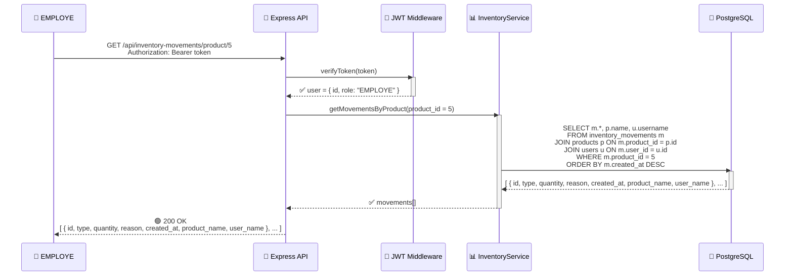
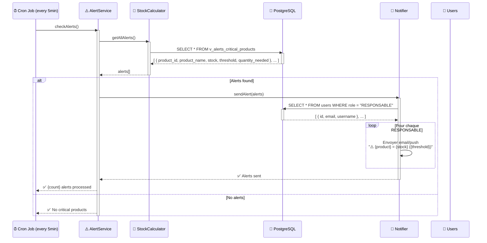

# 🔄 Diagrammes de Séquence (Sequence Diagrams)

## Flux 1 : Authentification (Login)

```mermaid
sequenceDiagram
    participant Client as 👤 Client
    participant API as 🔗 Express API
    participant Auth as 🔐 AuthService
    participant DB as 💾 PostgreSQL
    participant JWT as 🔑 JWT Generator

    Client->>API: POST /api/auth/login<br/>{ username, password }
    
    API->>Auth: login(username, password)
    activate Auth
    
    Auth->>DB: SELECT * FROM users<br/>WHERE username = ?
    activate DB
    DB-->>Auth: user record ou NULL
    deactivate DB
    
    alt User trouvé
        Auth->>Auth: bcrypt.compare(password, hashedPwd)
        
        alt Password correct
            Auth->>JWT: generateJWT(user.id, user.role)
            activate JWT
            JWT-->>Auth: token = "eyJhbGc..."
            deactivate JWT
            
            Auth-->>API: ✅ { token, role, username }
            deactivate Auth
            
            API-->>Client: 🟢 200 OK<br/>{ token, role, username }
            Client->>Client: localStorage.setItem('token', token)
        else Password incorrect
            Auth-->>API: ❌ { error: "Invalid password" }
            deactivate Auth
            
            API-->>Client: 🔴 401 Unauthorized
        end
    else User not found
        Auth-->>API: ❌ { error: "User not found" }
        deactivate Auth
        
        API-->>Client: 🔴 401 Unauthorized
    end
```

---

## Flux 2 : Enregistrement (Registration)

```mermaid
sequenceDiagram
    participant Client as 👤 Client
    participant API as 🔗 Express API
    participant Validator as ✓ Validator
    participant Auth as 🔐 AuthService
    participant Crypto as 🔒 bcrypt
    participant DB as 💾 PostgreSQL

    Client->>API: POST /api/auth/register<br/>{ username, password, role }
    
    API->>Validator: validateUser(data)
    activate Validator
    
    alt Validation OK
        Validator-->>API: true
        deactivate Validator
        
        API->>Auth: register(username, password, role)
        activate Auth
        
        Auth->>DB: SELECT * FROM users<br/>WHERE username = ?
        activate DB
        DB-->>Auth: NULL (not exists)
        deactivate DB
        
        Auth->>Crypto: bcrypt.hash(password, 10)
        activate Crypto
        Crypto-->>Auth: $2b$10$...hashed...
        deactivate Crypto
        
        Auth->>DB: INSERT INTO users<br/>(username, password, role)<br/>VALUES (?, ?, ?)
        activate DB
        DB-->>Auth: user_id = 42
        deactivate DB
        
        Auth-->>API: ✅ { id: 42, username, role }
        deactivate Auth
        
        API-->>Client: 🟢 201 Created<br/>{ id, username, role }
    else Validation KO
        Validator-->>API: false + error message
        deactivate Validator
        
        API-->>Client: 🔴 400 Bad Request<br/>{ error: "..." }
    end
```

---

## Flux 3 : Consultation Produits (GET /api/products)

```mermaid
sequenceDiagram
    participant Client as 👤 Client
    participant API as 🔗 Express API
    participant Auth as 🔐 JWT Middleware
    participant Product as 📦 ProductService
    participant DB as 💾 PostgreSQL

    Client->>API: GET /api/products<br/>Authorization: Bearer token
    
    API->>Auth: verifyToken(token)
    activate Auth
    
    alt Token valide
        Auth->>Auth: Extraire user.id, user.role
        Auth-->>API: ✅ user = { id, role }
        deactivate Auth
        
        API->>Product: getAll()
        activate Product
        
        Product->>DB: SELECT * FROM products<br/>ORDER BY name
        activate DB
        DB-->>Product: products[] = [{id, name, ...}]
        deactivate DB
        
        Product-->>API: ✅ products[]
        deactivate Product
        
        API-->>Client: 🟢 200 OK<br/>[ products ]
    else Token invalide/expiré
        Auth-->>API: ❌ token invalid
        deactivate Auth
        
        API-->>Client: 🔴 401 Unauthorized
    else Token absent
        Auth-->>API: ❌ no token
        deactivate Auth
        
        API-->>Client: 🔴 401 Missing Authorization
    end
```

---

## Flux 4 : Création Produit (POST /api/products) - RESPONSABLE uniquement

```mermaid
sequenceDiagram
    participant Client as 🔐 RESPONSABLE
    participant API as 🔗 Express API
    participant Auth as 🔐 JWT Middleware
    participant Role as 👔 RBAC Middleware
    participant Validator as ✓ Validator
    participant Product as 📦 ProductService
    participant DB as 💾 PostgreSQL

    Client->>API: POST /api/products<br/>{ name, category, unit, minThreshold }<br/>Authorization: Bearer token

    API->>Auth: verifyToken(token)
    activate Auth
    Auth-->>API: ✅ user = { id, role: "RESPONSABLE" }
    deactivate Auth

    API->>Role: checkRole(user.role, ["RESPONSABLE"])
    activate Role
    
    alt Role OK
        Role-->>API: ✅ Authorized
        deactivate Role

        API->>Validator: validateProduct(data)
        activate Validator
        
        alt Validation OK
            Validator-->>API: ✅ true
            deactivate Validator

            API->>Product: create(data)
            activate Product

            Product->>DB: INSERT INTO products<br/>(name, category, unit, minThreshold)<br/>VALUES (?, ?, ?, ?)
            activate DB
            DB-->>Product: product_id = 123
            deactivate DB

            Product-->>API: ✅ { id: 123, name, category, unit, minThreshold }
            deactivate Product

            API-->>Client: 🟢 201 Created<br/>{ id, name, category, unit, minThreshold }
        else Validation KO
            Validator-->>API: false + error
            deactivate Validator
            API-->>Client: 🔴 400 Bad Request
        end
    else Role NOT OK
        Role-->>API: ❌ Forbidden (EMPLOYE cannot create)
        deactivate Role
        
        API-->>Client: 🔴 403 Forbidden<br/>{ error: "Insufficient permissions" }
    end
```

---

## Flux 5 : Créer Mouvement de Stock (POST /api/inventory-movements) - RESPONSABLE

```mermaid
sequenceDiagram
    participant Client as 🔐 RESPONSABLE
    participant API as 🔗 Express API
    participant Auth as 🔐 JWT Middleware
    participant Role as 👔 RBAC Middleware
    participant Validator as ✓ Validator
    participant Inventory as 📊 InventoryService
    participant Calculator as 🧮 StockCalculator
    participant DB as 💾 PostgreSQL
    participant Alert as ⚠️ Alert Service

    Client->>API: POST /api/inventory-movements<br/>{ product_id, type, quantity, reason }<br/>Authorization: Bearer token

    API->>Auth: verifyToken(token)
    activate Auth
    Auth-->>API: ✅ user = { id: 42, role: "RESPONSABLE" }
    deactivate Auth

    API->>Role: checkRole(user.role, ["RESPONSABLE"])
    activate Role
    Role-->>API: ✅ Authorized
    deactivate Role

    API->>Validator: validateMovement(data)
    activate Validator
    
    alt Validation OK
        Validator->>DB: SELECT * FROM products WHERE id = ?
        activate DB
        DB-->>Validator: product exists ✅
        deactivate DB
        
        Validator-->>API: ✅ true
        deactivate Validator

        API->>Inventory: addMovement(product_id, user_id, type, quantity, reason)
        activate Inventory

        Inventory->>DB: INSERT INTO inventory_movements<br/>(product_id, user_id, type, quantity, reason)<br/>VALUES (?, ?, ?, ?, ?)
        activate DB
        DB-->>Inventory: movement_id = 567
        deactivate DB

        Inventory->>Calculator: calculateStock(product_id)
        activate Calculator
        
        Calculator->>DB: SELECT SUM(...) FROM inventory_movements WHERE product_id = ?
        activate DB
        DB-->>Calculator: stock_actuel = 45
        deactivate DB
        
        Calculator-->>Inventory: 45
        deactivate Calculator

        Inventory->>Alert: checkAlert(product_id, stock_actuel, min_threshold)
        activate Alert
        
        alt Stock <= Threshold
            Alert->>Alert: Génère alerte
            Alert-->>Inventory: ⚠️ Alert { product_id, stock, threshold }
        else Stock OK
            Alert-->>Inventory: ✅ No alert
        end
        deactivate Alert

        Inventory-->>API: ✅ { movement_id, product_id, type, quantity, stock_actuel }
        deactivate Inventory

        API-->>Client: 🟢 201 Created<br/>{ id, product_id, type, quantity, reason, stock_after: 45 }
    else Validation KO
        Validator-->>API: ❌ error
        deactivate Validator
        API-->>Client: 🔴 400 Bad Request
    end
```

---

## Flux 6 : Consulter Historique Produit (GET /api/inventory-movements/product/:id)



---

## Flux 7 : Générer Alertes (Background Service)



---

## Flux 8 : Dashboard KPI (GET /api/dashboard)

```mermaid
sequenceDiagram
    participant Client as 👤 User
    participant API as 🔗 Express API
    participant Auth as 🔐 JWT Middleware
    participant Dashboard as 📊 DashboardService
    participant DB as 💾 PostgreSQL
    participant Cache as 💾 Redis (Optional)

    Client->>API: GET /api/dashboard<br/>Authorization: Bearer token

    API->>Auth: verifyToken(token)
    Auth-->>API: ✅ user

    API->>Dashboard: getKPIs()
    activate Dashboard

    Dashboard->>Cache: get('dashboard_kpi')
    activate Cache
    
    alt Cache hit (< 1min)
        Cache-->>Dashboard: { total_produits, produits_en_alerte, ... }
        deactivate Cache
    else Cache miss
        Cache-->>Dashboard: null
        deactivate Cache

        Dashboard->>DB: SELECT * FROM v_dashboard_json
        activate DB
        DB-->>Dashboard: { total_produits, produits_en_alerte, stock_total, stock_moyen, maj_time }
        deactivate DB

        Dashboard->>Cache: set('dashboard_kpi', data, 60s)
        activate Cache
        Cache-->>Dashboard: ✅ cached
        deactivate Cache
    end

    Dashboard-->>API: ✅ { total_produits: 15, produits_en_alerte: 2, stock_total: 500, stock_moyen: 33.3 }
    deactivate Dashboard

    API-->>Client: 🟢 200 OK<br/>{ total_produits: 15, produits_en_alerte: 2, stock_total: 500, stock_moyen: 33.3 }
```

---

## Flux 9 : Modification Produit (PUT /api/products/:id) - RESPONSABLE

```mermaid
sequenceDiagram
    participant Client as 🔐 RESPONSABLE
    participant API as 🔗 Express API
    participant Auth as 🔐 JWT Middleware
    participant Role as 👔 RBAC Middleware
    participant Product as 📦 ProductService
    participant Validator as ✓ Validator
    participant DB as 💾 PostgreSQL

    Client->>API: PUT /api/products/123<br/>{ name?, category?, minThreshold? }<br/>Authorization: Bearer token

    API->>Auth: verifyToken(token)
    Auth-->>API: ✅ user

    API->>Role: checkRole("RESPONSABLE")
    Role-->>API: ✅ Authorized

    API->>Product: update(id = 123, data)
    activate Product

    Product->>Validator: validateProduct(data)
    activate Validator
    
    alt Validation OK
        Validator-->>Product: ✅
        deactivate Validator

        Product->>DB: SELECT * FROM products WHERE id = 123
        activate DB
        DB-->>Product: product exists
        deactivate DB

        Product->>DB: UPDATE products SET name = ?, category = ?, minThreshold = ?<br/>WHERE id = 123
        activate DB
        DB-->>Product: 1 row updated
        deactivate DB

        Product-->>API: ✅ { id, name, category, minThreshold }
        deactivate Product

        API-->>Client: 🟢 200 OK
    else Validation KO
        Validator-->>Product: ❌
        deactivate Validator
        Product-->>API: ❌
        deactivate Product
        API-->>Client: 🔴 400 Bad Request
    end
```

---

## Flux 10 : Suppression Produit (DELETE /api/products/:id) - RESPONSABLE

```mermaid
sequenceDiagram
    participant Client as 🔐 RESPONSABLE
    participant API as 🔗 Express API
    participant Auth as 🔐 JWT Middleware
    participant Role as 👔 RBAC Middleware
    participant Product as 📦 ProductService
    participant DB as 💾 PostgreSQL

    Client->>API: DELETE /api/products/123<br/>Authorization: Bearer token

    API->>Auth: verifyToken(token)
    Auth-->>API: ✅ user

    API->>Role: checkRole("RESPONSABLE")
    Role-->>API: ✅ Authorized

    API->>Product: delete(id = 123)
    activate Product

    Product->>DB: SELECT COUNT(*) FROM inventory_movements<br/>WHERE product_id = 123
    activate DB
    
    alt Movements exist
        DB-->>Product: count = 5
        deactivate DB

        Product-->>API: ❌ Cannot delete (FK constraint)
        deactivate Product

        API-->>Client: 🔴 409 Conflict<br/>{ error: "Product has movement history" }
    else No movements
        DB-->>Product: count = 0
        deactivate DB

        Product->>DB: DELETE FROM products WHERE id = 123
        activate DB
        DB-->>Product: 1 row deleted
        deactivate DB

        Product-->>API: ✅ Deleted
        deactivate Product

        API-->>Client: 🟢 204 No Content
    end
```

---

## 📊 Résumé des Flux

| Flux | Endpoint | Méthode | Auth | RBAC | Déclencheurs |
|------|----------|--------|------|------|---|
| Login | `/api/auth/login` | POST | ❌ | - | JWT généré |
| Register | `/api/auth/register` | POST | ❌ | - | User créé |
| Get Products | `/api/products` | GET | ✅ | EMPLOYE, RESPONSABLE | - |
| Create Product | `/api/products` | POST | ✅ | RESPONSABLE | - |
| Update Product | `/api/products/:id` | PUT | ✅ | RESPONSABLE | - |
| Delete Product | `/api/products/:id` | DELETE | ✅ | RESPONSABLE | FK check |
| Create Movement | `/api/inventory-movements` | POST | ✅ | RESPONSABLE | Stock recalcul, Alerte check |
| Get Movements | `/api/inventory-movements` | GET | ✅ | EMPLOYE, RESPONSABLE | - |
| Get History | `/api/inventory-movements/product/:id` | GET | ✅ | EMPLOYE, RESPONSABLE | - |
| Get Dashboard | `/api/dashboard` | GET | ✅ | EMPLOYE, RESPONSABLE | Cache (1 min) |

---

## ⏱️ Temps de Réponse Estimés

| Opération | Sans Index | Avec Index | Notes |
|-----------|-----------|-----------|--------|
| Login | 50-100ms | 10-20ms | bcrypt + JWT |
| Get Products | 100-200ms | 20-50ms | SELECT simple |
| Get Movements | 150-300ms | 30-100ms | JOIN 3 tables |
| Create Movement | 200-400ms | 50-150ms | INSERT + Trigger |
| Dashboard | 300-500ms | 100-200ms | Vues + Cache (1 min) |

---

## ✅ Points de Validation

- [ ] Tous les flux utilisent JWT pour sécurité
- [ ] RBAC vérifié avant logique métier
- [ ] Validation de données centralisée
- [ ] Erreurs gérées et retournées au client
- [ ] Stock recalculé après mouvement
- [ ] Alertes générées si stock critique
- [ ] Intégrité référentielle (FK RESTRICT)
- [ ] Traçabilité complète (user_id, created_at)

---

**Document rédigé le : 11/03/2026**  
**Statut : COMPLET ✅**
